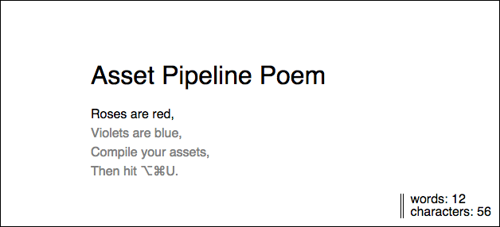

# Asset Pipeline Poem

| **Objectives** |
| :---- |
| Explore the assets pipeline in rails |
| Practice structuring require statements |
| Precompile compressed javascript assets |

**Terms:**

- Manifest
- Pre/compilation
- Concatenation
- Compression / Minification
- Browser Caching
- MD5 fingerprint

###Instructions:

* **This rails app does not have a database.**
* Your goal is to reconstruct a simple poem
* DO NOT modify any files, you are only allowed to "require" them in the manifest.
* When you precompile your javascript assets, they should all appear in application.js
* Your solution should work in production:
    - `rails server --environment=production`

###The Asset Pipeline
Assets live in the following locations, inside of your rails application directory:

    app/
        assets/
            images/
            javascripts/
            stylesheets/
    lib/
        assets/
            javascripts/
            stylesheets/
    vendor/
        assets/
            javascripts/
            stylesheets/

Each directory has a specific use-case. Do you know which is which?

After running `RAILS_ENV=development rake assets:precompile`, your concatenated/compressed assets will live in:

    public/
        assets/

When in doubt, start fresh:

- Delete `tmp/cache/assets/`
- Delete `public/assets/`
- ( OR, you can just run: `RAILS_ENV=development rake assets:clobber` )
- Restart your Server

---

###Additional Goals:
1. There's a nifty little library I've written for calculating word counts and character counts called "poem_meta_data" (see `/lib`). Include it.
2. Note that reset.css is being included using a CDN. It's a quick and dirty way of including it, but let's save it locally:
    + `touch reset.css`
    + `curl -vs URL_OF_CSS_FILE > reset.css`
    + Then, delete the old cdn link, and "require" the new reset. (Where are you going to put it?)

When you're done it should look like this:

####Reading
http://guides.rubyonrails.org/asset_pipeline.html
https://github.com/rails/sprockets#sprockets-directives
